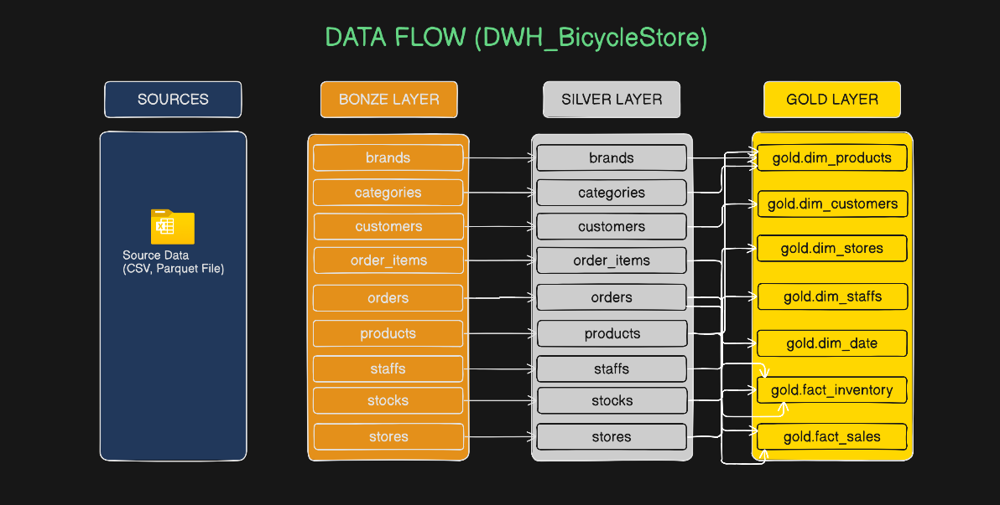

# DWH_BicycleStore 🚲

## Project Overview
This project implements a modern Data Warehouse (DWH) for a Bicycle Store using the **Medallion Architecture**. The goal is to transform raw data from various sources into a structured, clean, and analytics-ready format to support business intelligence and decision-making.

The pipeline follows a structured approach of moving data through three distinct layers: **Bronze**, **Silver**, and **Gold**.

## Data Architecture


## Data Flow


## Architecture Layers

1.  **Bronze Layer (Raw Data):**
    *   Contains the raw data ingested directly from source files (CSV and Parquet).
    *   Acts as the single source of truth for the data warehouse.
2.  **Silver Layer (Cleansed & Conformed):**
    *   Data is cleaned, filtered, and transformed.
    *   Schema is enforced, and data quality checks are applied to ensure consistency.
3.  **Gold Layer (Business Ready):**
    *   Data is aggregated and modeled into dimensional structures (Star Schema).
    *   Optimized for high-performance querying and BI tools.

## Tech Stack

*   **Language:** [Python](https://www.python.org/)
*   **Data Processing:** [Pandas](https://pandas.pydata.org/)
*   **Database Connectivity:** [SQLAlchemy](https://www.sqlalchemy.org/) & [pyodbc](https://pypi.org/project/pyodbc/)
*   **Database:** Microsoft SQL Server
*   **Storage Formats:** CSV, Parquet
*   **Environment Management:** `venv` (Virtual Environment)


## Installation
1. Clone the repository:
   ```bash
   git clone https://github.com/your-username/DWH_BicycleStore.git
   cd DWH_BicycleStore
   ```

2. Create and activate a virtual environment:
   ```bash
   python -m venv .venv
   # On Windows:
   .venv\Scripts\activate
   # On macOS/Linux:
   source .venv/bin/activate
   ```

3. Install dependencies:
   ```bash
   pip install -r requirements.txt
   ```

4. Configure your database connection in `scripts/config/database.py`.

5. Run the ingestion script to populate the Bronze layer:
   ```bash
   python -m scripts.loading.load_to_sql
   ```
